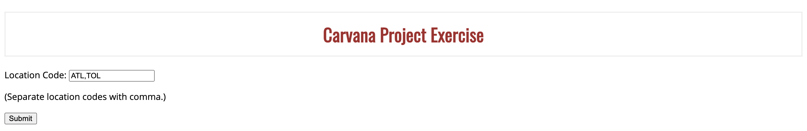
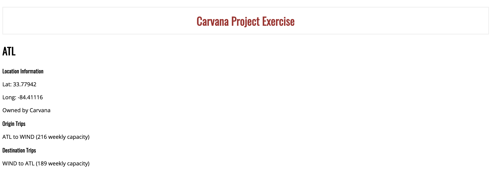
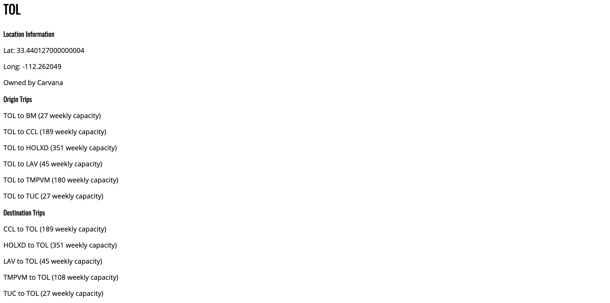

# Project: Carvana Exercise

A web application that loads locations and trips data sources, 
take a location or multiple locations user input, 
and return the geographic and weekly capacity information of that location. 

## Prerequisites
- numpy >= 1.21.2
- pandas >= 1.1.5
- Flask >= 2.0.1

## Building and running with Docker

### Build
```bash
docker build . -t carvanaproject:latest
```

### Run
```bash
docker run -d -p 5000:5000 carvanaproject:latest
```

You should see the home page when visiting ```http://localhost:5000```.

### Example usage
User input location code in the index page. (Use comma to separate multiple location codes.)



Example output of ATL and TOL.




## Run Test ## 
```bash
python -m unittest test.py
```

## Author
👩‍💻 Joanne Lin
- Github: https://github.com/hfoiris
- Linkedin: https://www.linkedin.com/in/joanneyuanlin/
